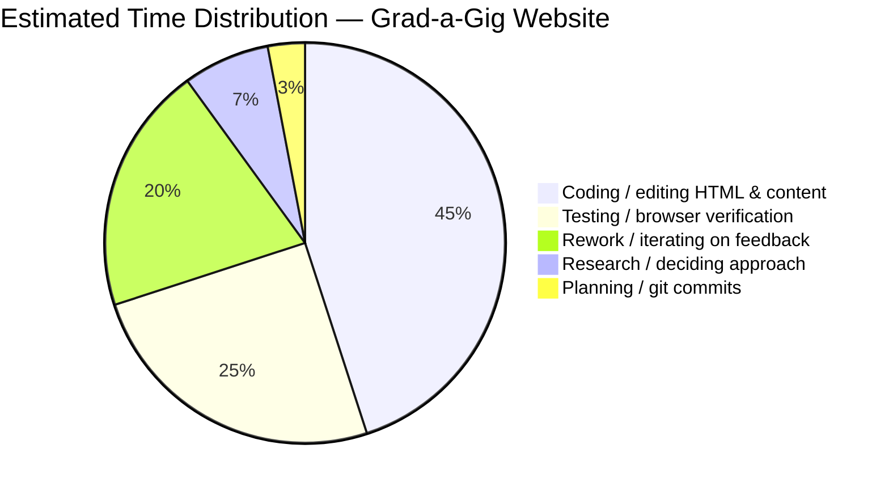
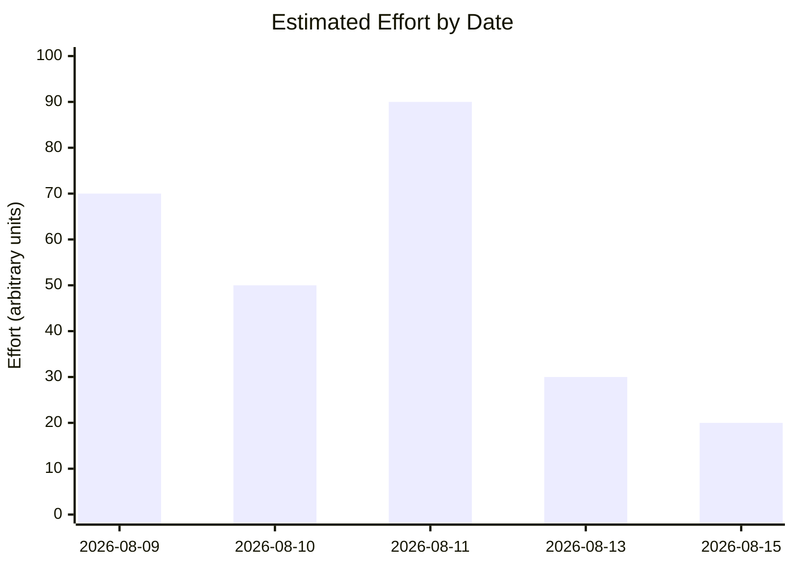

# Grad-a-Gig Website — Project Summary

## Project
- **Name:** Grad-a-Gig Website
- **Repository:** `roger64s/gradagig-website`
- **Period:** 2026-08-09 to 2026-08-15
- **Goal:** Update the public landing page to surface end-to-end software delivery for business clients with a prominent demo and clear conversion path, and make registration forms functional.

## Scope Delivered
- Refactored the hero section to a business-client-first layout.
- Embedded a Loom demo video as an expandable modal teaser.
- Added CTAs: "Register your interest" and "See Demo".
- Added client registration anchor for focused conversion.
- Pushed all updates to GitHub for deployment to `gradagig.com`.

## Time / Effort Distribution

## Estimated Effort by Date

## Timeline

| Date | Milestone |
|------|-----------|
| 2026-08-09 | Initial landing page created (index.html) |
| 2026-08-10 | CodeWithKris R&D prototype section added |
| 2026-08-11 | Hero demo panel added, iterated to compact teaser, CTAs finalized and pushed |
| 2026-08-13 | Thank-you page added, form email notifications configured |
| 2026-08-15 | Added ZERO RISK text overlay to video frame, styling finalized |

## Final State
- Hero: headline + "Register your interest" CTA + "See Demo" link + expandable video teaser.
- Video teaser now includes "ZERO RISK (SourceCode Escrow)" text overlay above the thumbnail.
- Site deployed via GitHub push to `origin/master`.
- `docs/PROJECT_SUMMARY.md` created with pie chart and timeline.

## Notes / Learnings
- Iterative CTA refinement improved clarity: single primary action + secondary demo link outperformed multiple similar buttons.
- Embedding Loom via iframe modal keeps the above-the-fold layout clean while still offering a playable demo.
