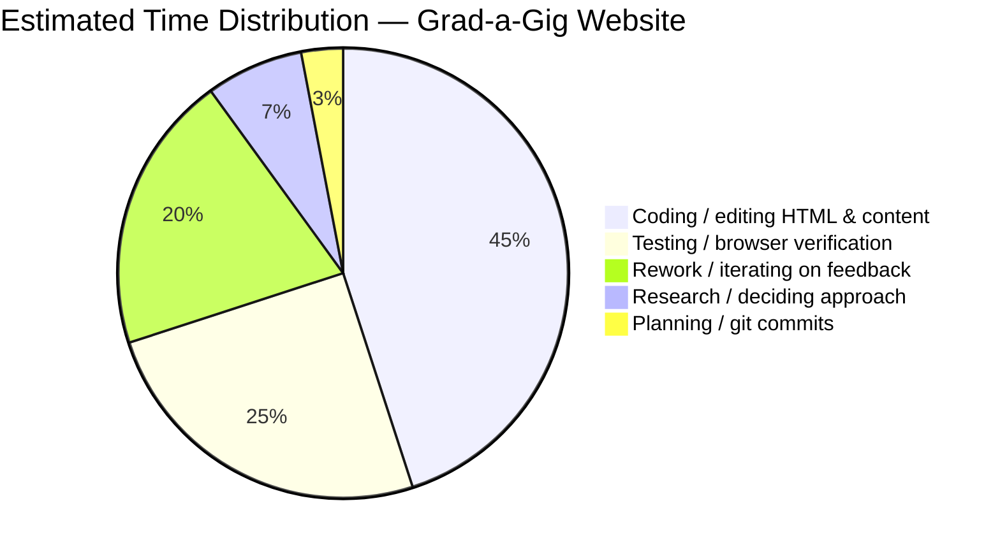
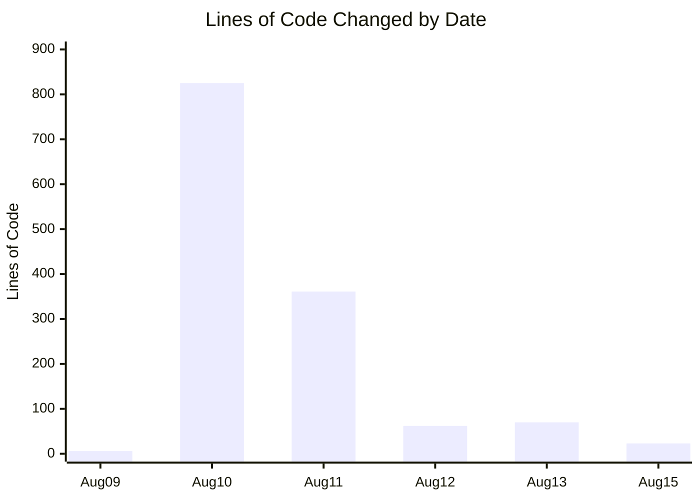

# Grad-a-Gig Website — Project Summary

## Project
- **Name:** Grad-a-Gig Website
- **Repository:** `roger64s/gradagig-website`
- **Period:** 2026-08-09 to 2026-08-17
- **Goal:** Update the public landing page to surface end-to-end software delivery for business clients with a prominent demo and clear conversion path, and make registration forms functional.

## Scope Delivered
- Refactored the hero section to a business-client-first layout.
- Embedded a Loom demo video as an expandable modal teaser.
- Added CTAs: "Register your interest" and "See Demo".
- Added client registration anchor for focused conversion.
- Pushed all updates to GitHub for deployment to `gradagig.com`.
- Updated the CRM Automation demo button to link to `https://crm-demo-ai-worklow.vercel.app/`.

## Time / Effort Distribution

### Calendar Time Spent by Date (estimated hours)

```
Date	Aug 09	Aug 10	Aug 11	Aug 12	Aug 13	Aug 15
Hours	2	5	5	1	3	1
```

### Lines of Code Changed by Date (actual from git)

```
Date	Aug 09	Aug 10	Aug 11	Aug 12	Aug 13	Aug 15
LOC	6	825	361	62	70	23
```

### Effort Breakdown by Category (estimated)

```
Date	Coding	Testing	Deployment	Rework	Planning	Total LOC
Aug 09	3	1	1	0	1	6
Aug 10	371	206	124	83	41	825
Aug 11	162	90	54	36	19	361
Aug 12	28	16	9	6	3	62
Aug 13	32	17	10	7	4	70
Aug 15	10	6	4	2	1	23
Total	606	336	202	134	69	1347
```

### Visual Charts

#### Pie Chart - Time Distribution



#### Bar Chart - Lines of Code by Date



#### Stacked Bar Chart - Effort Breakdown by Category

```mermaid
xychart-beta
    title "Effort Breakdown by Category (LOC)"
    x-axis [Aug 09, Aug 10, Aug 11, Aug 12, Aug 13, Aug 15]
    y-axis "Lines of Code" 0 --> 900
    bar [3, 371, 162, 28, 32, 10]
    bar [1, 206, 90, 16, 17, 6]
    bar [1, 124, 54, 9, 10, 4]
    bar [0, 83, 36, 6, 7, 2]
    bar [1, 41, 19, 3, 4, 1]
```



**Legend (bottom to top):** Coding (45%) | Testing (25%) | Deployment | Rework (20%) | Planning (7%)

**Interactive Charts:** View live charts at [`docs/charts.html`](docs/charts.html) or on the live site at https://gradagig.com/docs/charts.html

## Timeline

| Date | Milestone |
|------|-----------|
| 2026-08-09 | Initial landing page created (index.html) |
| 2026-08-10 | CodeWithKris R&D prototype section added |
| 2026-08-11 | Hero demo panel added, iterated to compact teaser, CTAs finalized and pushed |
| 2026-08-13 | Thank-you page added, form email notifications configured |
| 2026-08-15 | Added ZERO RISK text overlay to video frame, styling finalized |
| 2026-08-17 | Updated the CRM Automation demo button URL and verified the local preview |

## Final State
- Hero: headline + "Register your interest" CTA + "See Demo" + "See Metrics" buttons + expandable video teaser.
- Video teaser now includes "ZERO RISK (SourceCode Escrow)" text overlay above the thumbnail.
- Product Demos section includes MOC Workflow, CRM Automation, CodeWithKris, and Project Metrics cards.
- CRM Automation demo button links to `https://crm-demo-ai-worklow.vercel.app/`.
- Interactive charts page at `docs/charts.html` with effort distribution, LOC metrics, and time tracking.
- Project chart values include visible numeric labels with readable colors and sizing.
- Site deployed via GitHub push to `origin/master`.
- `docs/PROJECT_SUMMARY.md` created with pie chart and timeline.

## Notes / Learnings
- Iterative CTA refinement improved clarity: single primary action + secondary demo link outperformed multiple similar buttons.
- Embedding Loom via iframe modal keeps the above-the-fold layout clean while still offering a playable demo.
